# MarkerML

## About
Simple markup and templating language, that is transpiled to HTML.

## Features
**TODO**

## Development

Project is implemented using Rust.
Lexer is written from scratch, while parser uses [chumsky](https://crates.io/crates/chumsky) library.

Development is split into a couple of stages:
1. Basic syntax parsing
2. Intermediate Representation and support for builtin components
3. Emitting HTML
4. Live reloading
5. Custom components definitions

## Examples

### Page
```
page[
    title="Sample page"
] {
    box[horizontal] {
        @(Hello world)
        @[bold](Bold text)
    }
    
    box[direction = "vertical"] {
        header[1](Welcome)
        #["https://google.com"](Nice link)
        header[level=2](Blah blah)
        image["https://picsum.photos/id/237/200/300"]
    }
    
    list[ordered] {
        @(First item)
        @(Second item)
    }
    
    list[unordered] {
        @(Something)
        @(Something else)
    }
    
    // By default box has vertical orientation
    box {
        paragraph(
            Lorem ipsum dolor
            sit amet
        )
        paragraph(
            Different paragraph
        )
        some_component[a = "Text", b = "other text"] {
            box {
                @(abc)
            }
            box {
                @(cde)
            }
        }
        other_component {
            @(Well)
        }
    }
}
```

### Creating reusable component
```
component other_component[
    child: slot
] {
    box[horizontal] {
        ${child}
        @(Hello)
    }
}
```

### Creating reusable component with multiple children
```
component some_component[
    default a: string,
    b: string = "abc",
    children: slot[]
] {
    box[horizontal] {
        @(${a})
        @(${b})
        list {
            ${children}
        }
    }
}
```

## Builtin components

### Box
Name: `box` \
Properties:
- `vertical`
- `horizontal`
- `x_align: string = "start" | "center" | "end"`. Default: `"start"`
- `y_align: string = "start" | "center" | "end"`. Default: `"start"`

### Text
Name: `@` \
Properties:
- `text content`

### Page
Name: `page` \
Properties:
- `title: string`

### Image
Name: `image` \
Properties:
- `default url: string`

### Link
Name: `#` \
Properties:
- `default url: string`
- `text name`

### List
Name: `list` \
Properties:
- `unordered`
- `ordered`
- `children: slot[]`

### Header
Name: `header` \
Properties:
- `default level: integer = 1`

### Paragraph
Name: `paragraph` \
Properties:
- `text content`

## Grammar

### Component instantiation

#### Component
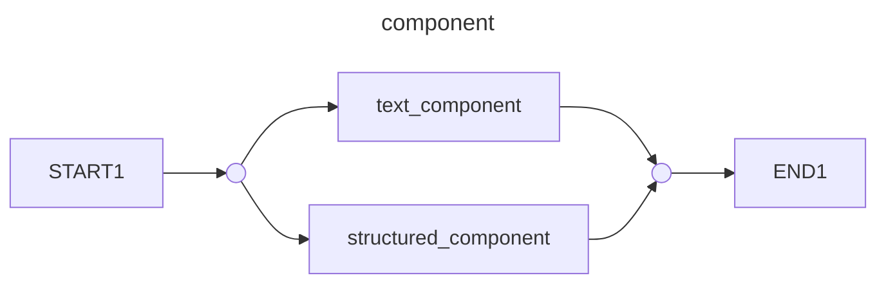

#### Structured component
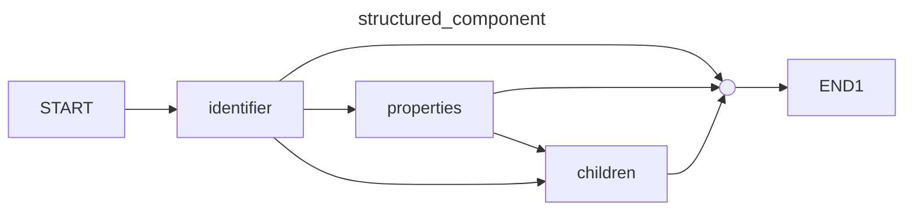

#### Text component
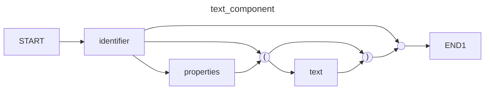

#### Component properties
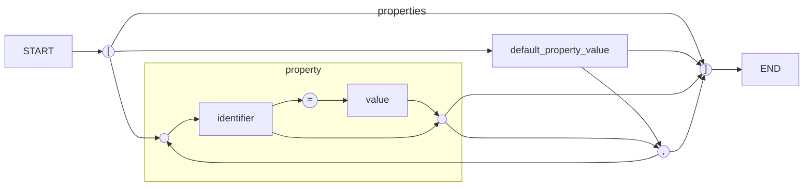

#### Component children
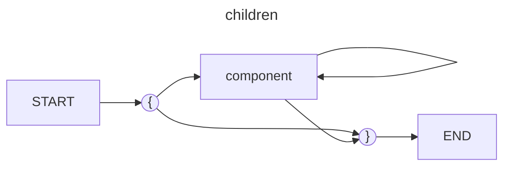

### Component definition

#### Component
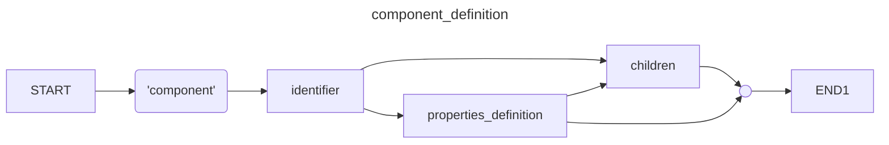

#### Component properties
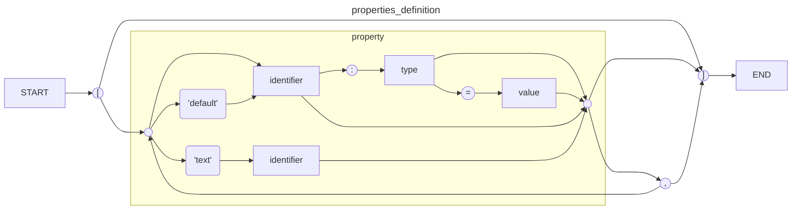

#### Type
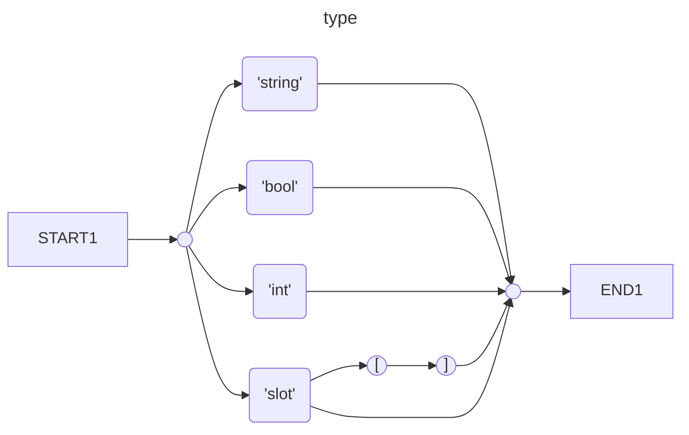

### Literals

#### Boolean
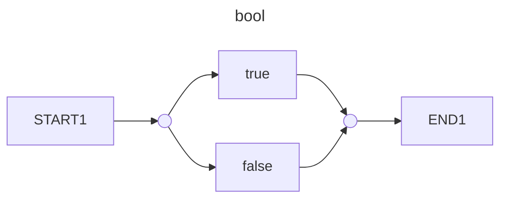


#### Integer
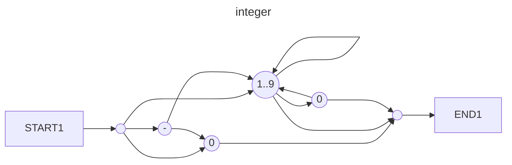


#### String
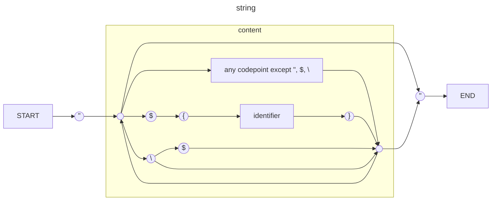

#### Text
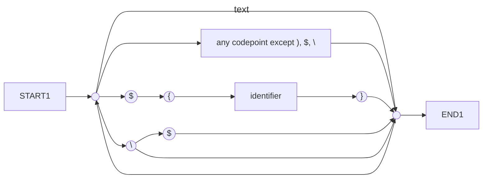

#### Identifier

Parsing occurs according to [Unicode Standard Annex #31](https://www.unicode.org/reports/tr31/#D1).
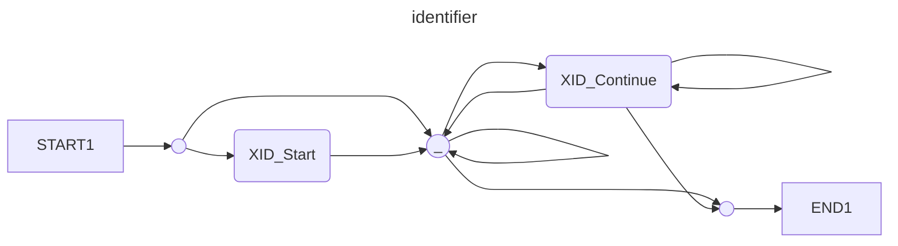

### Values
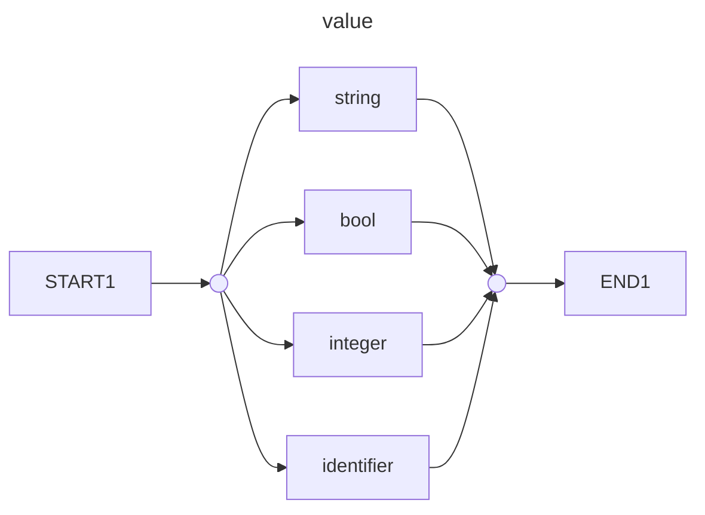

### Miscellaneous

#### Comment
