# MarkerML

## About
MarkerML stands for Marker Markup Language.
It's a simple language for formatting and layouting
text similar to HTML.

## Technical Description

Project is implemented using Rust.
Parser is written using [pest](https://crates.io/crates/pest) library.
[thiserror](https://crates.io/crates/thiserror) is used for library crates
and [anyhow](https://crates.io/crates/anyhow) is used for cli and tests.
[miette](https://crates.io/crates/miette) is used to display nice human-readable compilation errors.

Code is split into two main crates:
- [markerml_cli]() - CLI for the MarkerML
- [markerml]() - top level library crate

And a couple of auxiliary crates:
- [markerml_backend]() - provides HTML generation
- [markerml_middleend]() - provides Intermediate Representation
- [markerml_frontend]() - provides parser 

First code is parsed from text into an Abstract Syntax Tree.
Then it's converted into an intermediate representation to simplify
further manipulations. It also catches some simple cases of semantic
errors such as duplicated property names. Finally, this intermediate
representation is used for generating HTML, which can be viewed in
a regular browser.

For a complete grammar overview, refer to the [markerml crate](https://docs.rs/markerml/0.1.2/markerml/).

## Example
```markerml
box {
    header[1](Hello, world!)
    paragraph(Some text)
    box[horizontal] {
        @(Wow)
    }
    box[vertical, x_align = "center"] {
        @(Wow)
        #["//www.google.com"](Link to google)
    }
}
```

## Builtin components

### Box
Name: `box` \
Properties:
- `vertical`
- `horizontal`
- `x_align: string = "start" | "center" | "end"`. Default: `"start"`
- `y_align: string = "start" | "center" | "end"`. Default: `"start"`

### Text
Name: `@` \
Properties:
- `text content`

### Image
Name: `image` \
Properties:
- `default url: string`

### Link
Name: `#` \
Properties:
- `default url: string`
- `text name`

### List
Name: `list` \
Properties:
- `unordered`
- `ordered`
- `children: slot[]`

### Header
Name: `header` \
Properties:
- `default level: integer = 1`

### Paragraph
Name: `paragraph` \
Properties:
- `text content`

## Grammar

```
WHITESPACE = _{ (" " | "\t" | NEWLINE)+ }

COMMENT = _{ "//" ~ (!NEWLINE ~ ANY)* ~ NEWLINE }

integer = @{ "-"? ~ ASCII_DIGIT+ }

bool = @{ "true" | "false" }

identifier = @{ (ASCII_ALPHA | "_") ~ (ASCII_ALPHANUMERIC | "_")* }

literal_newline = @{ NEWLINE ~ (" " | "\t")* }

string_literal_segment = @{ (!("$" | "\"" | NEWLINE) ~ ANY)+ }

text_literal_segment = @{ (!("$" | ")" | NEWLINE) ~ ANY)+ }

variable_interpolation = { "${" ~ identifier ~ "}" }

string_segment = ${ literal_newline | variable_interpolation | string_literal_segment }

text_segment = ${ literal_newline | variable_interpolation | text_literal_segment }

string = @{ "\"" ~ string_segment* ~ "\"" }

text = @{ "(" ~ text_segment* ~ ")" }

value = { variable_interpolation | bool | string | integer }

component_name = { "@" | "#" | identifier }

default_property = { value }

named_property = { identifier ~ "=" ~ value }

flag_property = { identifier }

property = { named_property | flag_property }

properties_list = _{ property ~ ("," ~ property)* }

properties = { "[" ~ (properties_list | (default_property ~ ("," ~ properties_list)?))?  ~ ","? ~ "]" }

children = { "{" ~ component* ~ "}" }

component = { component_name ~ properties? ~ children? ~ text? }

ty = @{ "string" | "int" | "bool" | "slot[]" | "slot" }

default_property_definition = { "default" ~ identifier ~ ":" ~ ty }

text_property_definition = { "text" ~ identifier }

named_property_definition = { identifier ~ ":" ~ ty ~ ("=" ~ value)? }

property_definition = { default_property_definition | text_property_definition | named_property_definition }

properties_definition_list = _{ property_definition ~ ("," ~ property_definition)* }

properties_definition = { "[" ~ properties_definition_list? ~ "]" }

component_definition = { "component" ~ identifier ~ properties_definition? ~ children? }

module_item = _{ component_definition | component }

module = { SOI ~ module_item* ~ EOI}
```

### Component instantiation

#### Component


#### Structured component


#### Text component


#### Component properties


#### Component children


### Component definition

#### Component


#### Component properties


#### Type


### Literals

#### Boolean


#### Integer

```mermaid
---
title: integer
---
graph LR;
    START1:::hidden
    END1:::hidden
    START(( ))
    END(( ))
    
    minus(("—"))
    digit(("1..9"))
    single_zero((0))
    zero((0))
    
    %% 
    START1 --> START
    
    %% 
    single_zero ----> END
    
    START ---> single_zero
    START --> minus
    START --> digit
    
    minus --> single_zero
    minus ---> digit
    digit --> digit
    digit --> END
    digit --> zero
    zero --> digit
    zero ---> END
    
    %% 
    END --> END1
```



#### String


#### Text


#### Identifier


### Values


#### Comment

